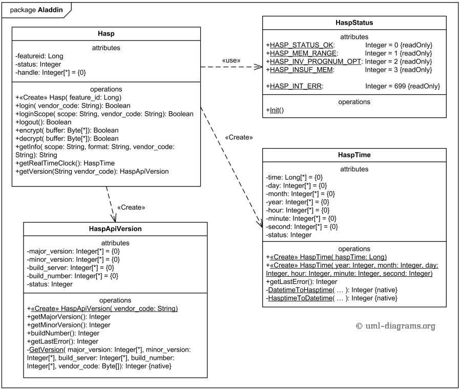

# 2018 October November

## Question 1

Use the following code to answer the questions that follow

```cpp
//class definition
class Counter{
public:
    Counter(int i);
    void increment(int i);
    void decrement(int i);
    void displayState(QString message = "Current value") const;
private:
    int num;
};

//class implementation
Counter Counter(int i) : num(i){
}

void Counter::increment(int i){
    num += 1;
    displayState("Number incremented to");
}

void Counter::decrement(int i){
    num -= 1;
    displayState("Number decremented to:");
}

void Counter::displayState(QString message) const{
    QMessageBox::information(0, "Information", QString("%1 %2").arg(message).arg(num), 0, 0);
}
```

1.1 Explain why only the function displayState() is made const in Counter?

<details>

<summary>Answer</summary>

displayState() essentially acts the same as a getter function, in that it only retrieves information that is then used for display purposes, thus it is not modifying or changing any class member data

</details>

1.2 The Counter class is an example of the God Object anti-pattern. Explain two responsibilities that are handled by Counter

<details>

<summary>Answer</summary>

* The counter class is responsible for displaying data
* As well as for calculating / computing data

</details>

1.3 Write code to restructure Counter in order to handle its responsibilities in two different classes without changing its overall functionality. These two classes must be decoupled from one another (independent of each other) by using signals and slots

<details>

<summary>Answer</summary>

```cpp
//class definition : Calculate Data
class CounterCalculate : public QObject{
    Q_OBJECT
public:
    CounterCalculate(int i);
    void increment(int i);
    void decrement(int i);
signals:
    void valueChanged(QString, int);
private:
    int num;
};

//class definition
class CounterDisplay : public QObject{
    Q_OBJECT
public:
    CounterDisplay(QObject *parent = null);
public slots:
    void displayState(QString message = "Current value", int num) const;
};

//class implementations
CounterCalculate::CounterCalculate(int i) : num(i){
}

void CounterCalculate::increment(int i){
    num += 1;
    QString message = "Number incremented to: ";
    emit valueChanged(message, num);
}

void CounterCalculate::decrement(int i){
    num -= 1;
    QString message = "Number decremented to: ";
    emit valueChanged(message, num);
} 

void CounterDisplay::displayState(QString message, int num) const{
    QMessageBox::information(0, "Information", QString("%1 %2").arg(message).arg(num), 0, 0);
}
```

</details>

1.4 Write a few lines of code to demonstrate how the two classes in 1.3 can be used together

<details>

<summary>Answer</summary>

```cpp
int main(){
    CounterCalculate *counter = new CounterCalculate(0);
    CounterDisplay *display = new CounterDisplay(this);
    connect(counter, &CounterCalculate::valueChanged, display, &CounterDisplay::displayState);
}
```

</details>

1.5 Modify Counter (either the given one or the modified one in 1.3) so that the state of a Counter object can be accessed via the QMetaObject interface

<details>

<summary>Answer</summary>

```cpp
//class definition : Calculate Data
class CounterCalculate : public QObject{
    Q_OBJECT
    Q_PROPERTY(int number READ getNum WRITE setNum NOTIFY valueChanged);
public:
    CounterCalculate(int i);
    void increment(int i);
    void decrement(int i);
    //Getter and Setter
    int getNum() const;
    void setNum(int i);
signals:
    void valueChanged(QString, int);
private:
    int num;
};
```

</details>

1.6 Demonstrate how a dynamic property can be added to a Counter object. Provide code to instantiate the object and the line of code to add the dynamic property

<details>

<summary>Answer</summary>

```cpp
CounterCalculate *obj = new CounterCalculate(0);
int value = 100;
obj->setProperty("PropertyName", value);
```

</details>

1.7 List one similarity and one difference between dynamic properties and properties accessed via the QMetaObject interface in the Qt framework

<details>

<summary>Answer</summary>

Similarity:

* Both Static and Dynamic properties rely on their respective classes inheriting from QObject
* Both properties can be discovered at runtime?

Difference:

* Dynamic properties are set at runtime and Static properties are set at compile time?
* Dynamic properties can are not known by the metaobject, and are created at runtime.

</details>

## Question 2

2.1 Explain the three components of the MVC pattern

<details>

<summary>Answer</summary>

The model is the application object.&#x20;

The view is the screen representation of the model.&#x20;

The controller defines a way the user interface reacts to user input.

</details>

2.2 Refer to the code below to answer the questions that follow

A staff member is modelled using their name, staff number and performance rating in the class Staff. The class StaffModel is used to set up a model to store a set of staff names, numbers and performance ratings

```cpp
class StaffModel : public QAbstractTableModel {
public:
    StaffModel(QObject *parent=0);
    QVariant data(const QModelIndex &index, int role) const;
    bool setData(const QModelIndex &index, const QVariant &value, int role);
    void addRow(Staff *s);
    void deleteRow(int row);
private:
    QList<QString> names;
    QList<int> numbers;
    QList<int> performance;
};
```

2.2.1 What is the purpose of the data() function in the StaffModel class?

<details>

<summary>Answer</summary>

The data() function returns a QVariant value for a specific Qt role for the item in the model with the given index

</details>

2.2.2 Write code for the data() function. You only need to provide code for Qt::DisplayRole functionality

<details>

<summary>Answer</summary>

```cpp
QVariant StaffModel::data(const QModelIndex &index, int role) const{
    if(!index.isValid()){
        return QVariant();
    }
    
    int col = index.column();
    int row = index.row();
        
    if(role == Qt::DisplayRole){
        switch(col){
        case 0:
            return names.at(row);
            break;
        case 1:
            return numbers.at(row);
            break;
        case 2:
            return performance.at(row);
            break;
        default:
            return QVariant();
        }
    }

    return QVariant();
}
```

</details>

2.3 Qt includes delegates as part of its model-view framework

2.3.1 Explain the use of delegates in the Qt implementation of the model-view framework

<details>

<summary>Answer</summary>

Unlike the Model-View-Controller pattern, the model/view design does not include a completely separate component for managing interaction with the user. Generally, the view is responsible for the presentation of model data to the user, and for processing user input. To allow some flexibility in the way this input is obtained, the interaction is performed by delegates. These components provide input capabilities and are also responsible for rendering individual items in some views.

</details>

2.3.2 Given the code snippet below and the StaffModel class in 2.2, add the necessary code to show how you would use a delegate named MyDelegate for the performance column.

```cpp
StaffModel *myModel = new StaffModel();
QTableView *myTableView = new QTableView();
myTbaleView->setModel(myModel);
//Add code here to use the delegate
```

<details>

<summary>Answer</summary>

```cpp
ui->myTable->setItemDelegateForColumn(2, new MyDelegate(this));
```

</details>

2.3.3 Assuming that the definition of MyDelegate is as follows, what functionality does the QStyledItemDelegate class provide?

```
class MyDelegate : public QStyledItemDelegate{
public:
    MyDelegate(QObject *parent=0);
};
```

<details>

<summary>Answer</summary>

Provides display and editing facilities for data items of a model?

</details>

## Question 3

The Memento pattern is used for capturing and externalizing the internal state of an object

3.1 When would the ability to hold the internal state of an object be useful?

<details>

<summary>Answer</summary>

So that the object can be restored to that internal state later?

</details>

3.2 Draw a UML diagram to illustrate the key classes, its data members and member functions, and the relationships between these key classes in the Memento pattern

<figure><figcaption></figcaption></figure>

3.3 Describe the main roles of the classes in the UML diagram given as answer to 3.2

<details>

<summary>Answer</summary>

Originator - an object that knows how to save its self.&#x20;

memento - the object that is written and read by an originator.&#x20;

Caretaker - the object that holds the memento for the originator, like a controller object, it knows when to backup, and restore the originator.

</details>

3.4 Assume that a Staff object can store its state in a QStringList named state, and a StaffMemento needs to be created to hold this state

3.4.1 Write the class definition of StaffMemento that would allow only a Staff object to have access to it. Do not write implementations for any functions that you include

<details>

<summary>Answer</summary>

```cpp
class StaffMemento{
private:
    firend class Staff;
    StaffMemento();
    void setState(QStringList s);
    QStringList getState() const;
    QStringList state;
};
```

</details>

3.4.2 Write code to implement the appropriate function of the Staff class that will be used to create StaffMemento

<details>

<summary>Answer</summary>

```
Staff
```

</details>

## Question 4

Refer to the following UML class diagram to answer the questions that follow

<figure><figcaption></figcaption></figure>

In the UML diagram Client is coupled with the concrete classes MergSort, InsertionSort and BubbleSort. Even though the solution provided in the class diagram works, it has some disadvantages,&#x20;

1. Client is aware of all the concrete sort classes
2. Client is not able to use these concrete sort algorithms interchangeably without knowing all the concrete sort classes and
3. Client needs to be changed if new concrete displays are added

To overcome these issues the Abstract Factory design pattern can be used so that the creation of the concrete algorithms, particularly sort algorithms in this case, is completely decoupled from Client

4.1 Re-draw the given class diagram to incorporate the suggested design pattern. Indicate the key functions as indicated in the given diagram

4.2 Explain briefly how the revised structure solves problems (1), (2) and (3) given in the introduction of the question
