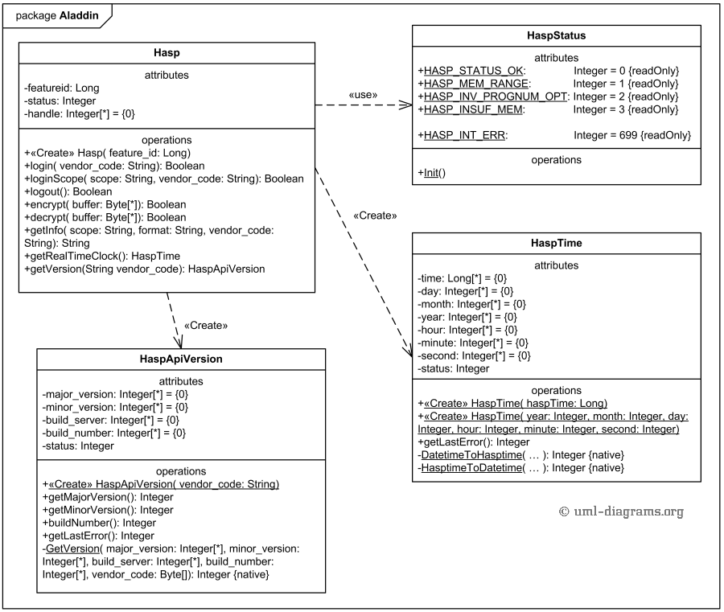

# UML Diagrams

#### What are UML diagrams?

Unified Modeling Language (UML) is a standardized modeling language. It helps software developers visualize, construct, and document new software systems and blueprints

#### Example UML diagram

<figure><figcaption><p><a href="https://www.uml-diagrams.org/software-licensing-class-diagram-example.html?context=cls-examples">Source</a></p></figcaption></figure>

Basic structure of a UML diagram element

<figure><figcaption></figcaption></figure>

#### Syntax

* _vis_ = Visibility (+ for public, - for private, # for protected)
* _attribute_ = Data member
* _operation_ = method

If you Italicize a method / class name, then it is virtual.

If you underline a method then it is static

To indicate a constant, use ALL CAPS

#### Types of relationships in a UML diagram

<figure><figcaption></figcaption></figure>

<details>

<summary>Association</summary>

If two classes in a model need to communicate with each other, there must be a link between them, and that can be represented by an association.

</details>

<details>

<summary>Directed Association</summary>

Association is a relationship between two classifiers that signifies that instances of the classifiers are able to communicate with each other. This means that an instance of one classifier can send messages to an instance of the other classifier and vice versa. An association is represented in a UML diagram by a solid line connecting the two classifiers. The line may have an arrowhead at one or both ends, indicating the direction of the communication. In addition, the association may be labeled with a name to indicate the role that each classifier plays in the relationship.

For example:\
Consider a simple UML diagram that shows the association between a `Customer` class and an `Order` class. The `Customer` class represents a customer of an online store, and the `Order` class represents an order that the customer has placed. The association between these two classes indicates that a customer can place one or more orders, and an order is associated with a single customer. This relationship might be represented in a UML diagram as follows:

```
      +------------+
      |  Customer  |
      +------------+
            |
            |  places
            |
           \ /
      +------------+
      |   Order    |
      +------------+
```

Here, the solid line connecting the `Customer` and `Order` classes represents the association between them. The arrowhead on the line indicates the direction of the communication, in this case from the `Customer` to the `Order`.

</details>

<details>

<summary>Reflexive Association</summary>

Reflexive association is a special type of association in which the two classifiers at the ends of the association are the same. This means that an instance of the classifier can send messages to itself, indicating that the classifier has some property or behavior that relates to itself.

In a UML diagram, a reflexive association is represented by a solid line with a cross at the end, connected to the classifier that it relates to. For example, consider a `Person` class that has a reflexive association with itself, indicating that a person can be a friend of another person. This relationship might be represented in a UML diagram as follows:

```
      +----------+
      |  Person  |X----------|
      +----------+           |
            |                |
            | Is a Friend of |
            |________________|

```

Here, the solid line with the cross at the end represents the reflexive association between the `Person` class and itself. The association may also be labeled with a name, such as "is friend of", to indicate the nature of the relationship.

Reflexive associations are useful for modeling relationships that involve some sort of self-reference, such as a person being a friend of another person. They can also be used to model recursive relationships, in which a class has a property or behavior that refers back to itself.

</details>

<details>

<summary>Multiplicity</summary>

Multiplicity is a property of an association that specifies the number of instances of one class that can be associated with a single instance of the other class. This is often used to indicate the cardinality of the relationship between the two classes, or the number of objects that can participate in the relationship.

In a UML diagram, multiplicity is typically represented by a range of numbers or a star symbol (_) next to the association line connecting the two classifiers. The range of numbers specifies the minimum and maximum number of instances that can be associated with a single instance of the other class. For example, a multiplicity of "1..\*_" indicates that there must be at least one instance associated with a single instance of the other class, and there can be any number of instances associated with it (including zero).

Here is an example of a UML diagram that shows the association between a `Person` class and a `Car` class, with multiplicity specified:

```
      +----------+
      |  Person  |
      +----------+
            | 1..*
            | owns
            |
      +------------+
      |    Car     |
      +------------+

```

In this example, the multiplicity of the association between the `Person` and `Car` classes is "1..\*". This means that a single person can own any number of cars (including zero), but a car must be owned by exactly one person.

Multiplicity is an important concept in UML, as it helps to specify the cardinality of relationships between classifiers and ensure that the relationships are well-defined and consistent. It also helps to avoid modeling errors, such as creating associations with invalid multiplicity ranges.

</details>

<details>

<summary>Dependency</summary>

A dependency is a relationship between two classifiers that signifies that a change in the state or definition of one classifier (the dependent classifier) may affect the other classifier (the independent classifier). This means that the independent classifier has some sort of reliance on the dependent classifier, and any changes to the dependent classifier may require corresponding changes to the independent classifier.

In a UML diagram, a dependency is typically represented by a dashed line connecting the two classifiers. The line may have an arrowhead at one end, indicating the direction of the dependency. For example, consider a simple UML diagram that shows the dependency between a `Customer` class and a `ShippingAddress` class. The `Customer` class represents a customer of an online store, and the `ShippingAddress` class represents the shipping address of the customer. The dependency between these two classes indicates that the `ShippingAddress` of a `Customer` can change, and any changes to the `ShippingAddress` may require corresponding changes to the `Customer`. This relationship might be represented in a UML diagram as follows:

```
      +------------+
      |  Customer  |
      +------------+
            |
            |  depends on
            |
           \ /
      +----------------+
      | ShippingAddress |
      +----------------+
```

Here, the dashed line connecting the `Customer` and `ShippingAddress` classes represents the dependency between them. The arrowhead on the line indicates the direction of the dependency, in this case from the `Customer` to the `ShippingAddress`. The dependency may also be labeled with a name, such as "depends on", to indicate the nature of the relationship.

Dependencies are useful for modeling relationships that involve some sort of reliance or dependency between classifiers. They can help to capture the dynamic behavior of the system and ensure that changes to one classifier do not break the functionality of other classifiers.

</details>

<details>

<summary>Aggregation</summary>

**A**ggregation is a special type of association that represents a whole-part relationship between two classifiers. This means that an instance of the whole class (the aggregate) contains one or more instances of the part class (the component), and the lifecycle of the part class is independent of the lifecycle of the whole class.

In a UML diagram, aggregation is represented by a hollow diamond shape attached to the aggregate class, with a solid line connecting the diamond to the component class. The diamond indicates that the aggregate class contains the component class, and the solid line indicates the association between the two classes. For example, consider a simple UML diagram that shows the aggregation between a `Department` class and an `Employee` class. The `Department` class represents a department in a company, and the `Employee` class represents an employee of the company. The aggregation between these two classes indicates that a department contains one or more employees, and the employees belong to a single department. This relationship might be represented in a UML diagram as follows:

```
       +------------+
       |  Employee  |
       +------------+
                 |
                 |  belongs to
                 |
                 /\
                 \/
       +------------+
       | Department |
       +------------+
```

Here, the hollow diamond attached to the `Department` class represents the aggregation between the `Department` and `Employee` classes. The solid line connecting the diamond to the `Employee` class indicates the association between the classes. The aggregation may also be labeled with a name, such as "belongs to", to indicate the nature of the relationship.

Aggregation is a useful concept in UML for modeling relationships in which one class contains one or more instances of another class. It is often used to model complex structures or compositions of objects, where the whole-part relationship is important to the functionality of the system.

</details>

<details>

<summary>Composition</summary>

**C**omposition is a special type of aggregation that represents a strong whole-part relationship between two classifiers. This means that an instance of the whole class (the composite) contains one or more instances of the part class (the component), and the lifecycle of the component is tightly coupled to the lifecycle of the composite. In other words, when the composite is destroyed, all of its components are also destroyed.

In a UML diagram, composition is represented by a filled diamond shape attached to the composite class, with a solid line connecting the diamond to the component class. The filled diamond indicates that the composite class contains the component class, and the solid line indicates the association between the two classes. For example, consider a simple UML diagram that shows the composition between a `Computer` class and a `Keyboard` class. The `Computer` class represents a computer, and the `Keyboard` class represents the keyboard of the computer. The composition between these two classes indicates that a computer contains a keyboard, and the keyboard cannot exist independently of the computer. This relationship might be represented in a UML diagram as follows:

```
       +------------+
       |  Keyboard  |
       +------------+
                 |
                 |  is part of
                 |
                 /x\
                 \x/
       +------------+
       |  Computer  |
       +------------+
```

Here, the filled diamond attached to the `Computer` class represents the composition between the `Computer` and `Keyboard` classes. The solid line connecting the diamond to the `Keyboard` class indicates the association between the classes. The composition may also be labeled with a name, such as "is part of", to indicate the nature of the relationship.

Composition is a useful concept in UML for modeling relationships in which one class contains one or more instances of another class, and the component class has a dependent lifecycle on the composite class. It is often used to model relationships in which the parts are essential to the functionality of the whole, and cannot exist independently.

</details>

<details>

<summary>Inheritance</summary>

Inheritance is a relationship between two classifiers that signifies that one classifier (the subclass or derived class) is a specialized version of the other classifier (the superclass or base class). This means that the subclass inherits the attributes, operations, and relationships of the superclass, and can add its own unique attributes and operations.

In a UML diagram, inheritance is represented by a solid line with a closed, filled triangle attached to the superclass, connected to the subclass. The triangle indicates that the subclass inherits from the superclass, and the solid line indicates the relationship between the two classes. For example, consider a simple UML diagram that shows the inheritance between a `Vehicle` class and a `Car` class. The `Vehicle` class represents a general category of vehicles, and the `Car` class represents a specific type of vehicle. The inheritance between these two classes indicates that a `Car` is a type of `Vehicle`, and it inherits the attributes and operations of the `Vehicle` class. This relationship might be represented in a UML diagram as follows:

```
       +------------+
       |   Vehicle  |
       +------------+
                /x\
                 |
                 |  is a
                 |
       +------------+
       |     Car    |
       +------------+
```

Here, the solid line with the triangle attached to the `Vehicle` class represents the inheritance between the `Vehicle` and `Car` classes. The solid line connecting the triangle to the `Car` class indicates the relationship between the classes. The inheritance may also be labeled with a name, such as "is a", to indicate the nature of the relationship.

Inheritance is a fundamental concept in object-oriented programming, and is useful for modeling relationships in which one class is a specialized version of another class. It allows for code reuse and simplifies the design of complex systems by allowing classes to be organized into a hierarchy of related classes.

</details>

<details>

<summary>Implementation / Realization</summary>

Realization is a relationship between two elements that signifies that one element (called the client) implements or realizes the behavior specified by another element (called the supplier).

Realization is typically depicted in a UML diagram using a solid line with a hollow arrowhead pointing from the client element to the supplier element, and is often accompanied by the "<\<realize>>" stereotype.

For example, in a class diagram, a class may realize the behavior specified in an interface by implementing all of the methods defined in the interface. In this case, the class is the client and the interface is the supplier, and the realization relationship is used to indicate that the class implements the behavior specified in the interface.

Here is an example of a realization relationship in a UML class diagram:

```
<<interface>> PaymentProcessor
  + processPayment(amount: double) : void

<<class>> CreditCardProcessor
  + processPayment(amount: double) : void
  + validateCard(cardNumber: string) : boolean

CreditCardProcessor --|x> PaymentProcessor
```

In this example, the CreditCardProcessor class realizes the behavior specified in the PaymentProcessor interface by implementing the `processPayment` method. The realization relationship is depicted using a solid line with a hollow arrowhead pointing from the CreditCardProcessor class to the PaymentProcessor interface.

</details>

#### Multiplicity

* 1..1: One and only one
* 0..\*: Zero or more
* 1..\*: One or more
* 0..1: Only none or one
* m..n: At least (m) and at most (n) where (m<=n)

#### Cardinality

Cardinality is a notation that specifies the number of instances of one class that can be associated with a single instance of another class

#### Classifier

A classifier is a type of element that represents a class or interface and defines its properties and behavior.
